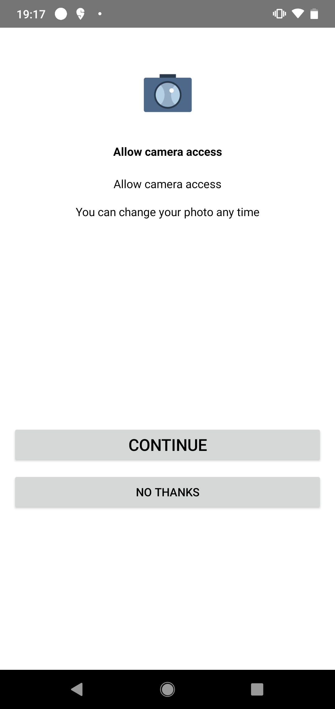
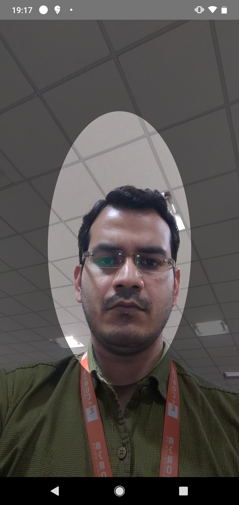

## SelfieAuth (df-selfie-check) SDK


This SDK is created to automatically capture the user's selfie using the facial expression (eye-blink). It will ensure that user have to be physically present while taking the selfie.

#### You can achieve the functionality with easy integration of following steps:
- In your project level `build.gradle` add this dependency:
```sh 
allprojects {
   repositories {
      jcenter()
       maven { url "https://dl.bintray.com/datafornix/selfiecheck" }
    }
 } 
```
- In your app level `build.gradle` add this dependency:
```sh
implementation 'selfiecheck:selfiecheck:1.0.0'
```
- Now in your project's activity create `SelfieCheckInstance` object: 
```sh
private lateinit var selfieCheckInstance: SelfieCheckInstance
```
- Initialise this object with your `sdkToken`
```sh
selfieCheckInstance = SelfieCheckInstance(this, YOUR_SDK_TOKEN)
```

#### You can customise the colour and theme of the SDK's view according to your project's user-experience.
#### Just access the properties mentioned in the SDK. Have a look at the sample below:

```sh
val selfieCheckConfig = SelfieCheckConfig()
selfieCheckConfig.tutorialScreenBackgroundColor = Color.GRAY
selfieCheckConfig.permissionScreenContinueButtonText = "Continue"
selfieCheckConfig.cameraScreenBackgroundColor = ContextCompat.getColor(this, R.color.black)
```

- Call `selfieCheck()` function from `selfieCheckInstance`
```sh
selfieCheckInstance.selfieCheck(
selfieCheckConfig,
object : SelfieCheckInstance.SelfieCheckListener {
    override fun onSelfieCheckFailure(error: SelfieCheckInstance.SelfieCheckError) {
	    // selfie check is failed duew to some reason
        showMessage(error.message)
    }

    override fun onSelfieCheckSuccess(path: String) {
		// selfie check is passed and you get path of selfie
        callSelfieUploadApi(path)
    }
})
```

- Override `onActivityResult`:
```sh
override fun onActivityResult(requestCode: Int, resultCode: Int, data: Intent?) {
   super.onActivityResult(requestCode, resultCode, data)
	 if (resultCode == Activity.RESULT_OK && requestCode == DfSCConstants.REQUEST_CODE_SELFIE_CHECK_INSTANCE) {
          if (::selfieCheckInstance.isInitialized) {
              selfieCheckInstance.onSelfieCheckResult(requestCode, resultCode, data)
          }
      }
}
```


#### By calling `selfieCheck()` method you will be redirected to the selfie authentication flow which is shown in below sequence of images:
<br>
<p align="left">



 <br>
