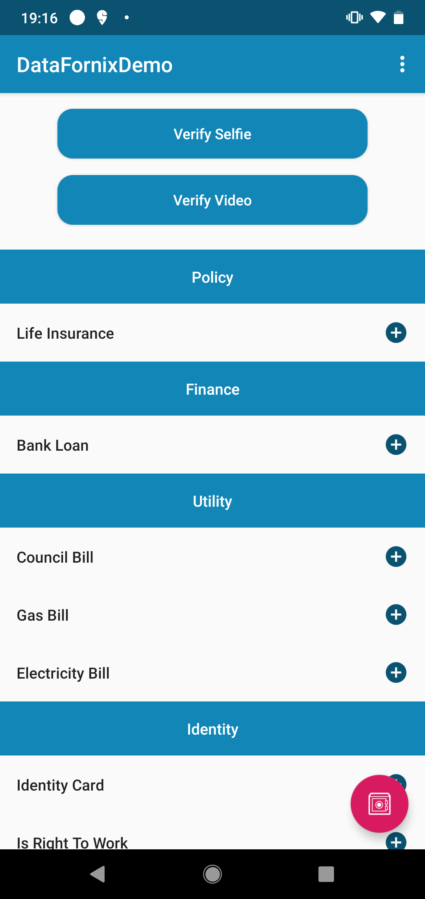
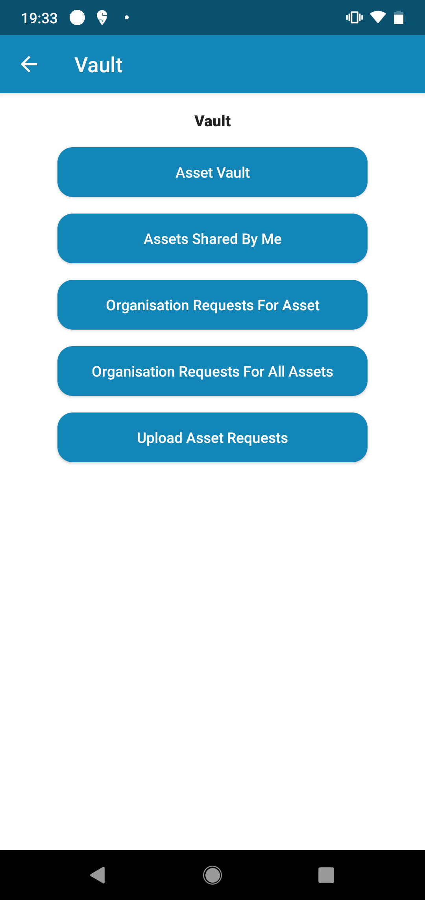
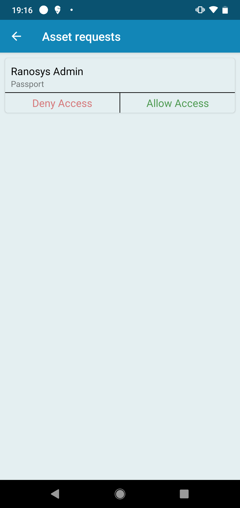
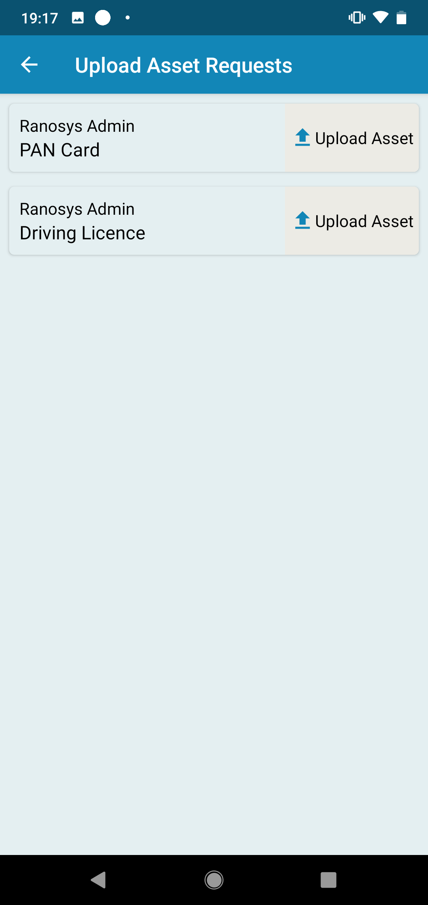

## Df-Vault SDK


**This SDK provide you storage and sharing features in miscellaneous aspects:** 

 - Provided you the list of all your uploaded assets.
 - Provide access of any assets to person/organisation with email address and upto a time period.
 - Show the list of assets those are shared to you.
 - Show the list of shared asset by you.
 - Provide you a list of access request(by any orgs or any person), which you can grant or deny.

#### You can achieve the functionality with easy integration of following steps:
- In your project level `build.gradle` add this dependency:
```sh 
allprojects {
   repositories {
      jcenter()
       maven { url "https://dl.bintray.com/datafornix/dfvaultmodule" }
    }
 } 
```
- In your app level `build.gradle` add this dependency:
```sh
implementation 'dfvaultmodule:dfvaultmodule:1.0.0'
```
- Now in your project's activity create `DatafornixVaultSdk` object: 
```sh
private lateinit var datafornixVaultSdk: DatafornixVaultSdk
```
- Initialise this object with your `sdkToken`
```sh
datafornixVaultSdk = DatafornixVaultSdk(this, "YOUR_SDK_TOKEN")
```

#### You can customise the colour and theme of the SDK's view according to your project's user-experience.
#### Just access the properties mentioned in the SDK. Have a look at the sample below:

```sh
datafornixVaultSdk.settings.showBackButtonInActionBar = true  
datafornixVaultSdk.settings.allAssetsScreenTitle = "All Documents"  
datafornixVaultSdk.settings.cardGradientTopColor = ContextCompat.getColor(this, R.color.white)  
datafornixVaultSdk.settings.denyAccessButtonText = "Revoke"  
datafornixVaultSdk.settings.screenBackgroundColor = ContextCompat.getColor(this, R.color.white)
```

- Open `VaultActivity` to avail all features of vault sdk as:
```sh
startActivity(Intent(this, VaultActivity::class.java))
```

#### By calling different different methods of`DatafornixVaultSdk` class you will be able to use all features of vault SDK and can get callbacks of the actions on all assets. Find table of all available methods in `DatafornixVaultSdk` SDK of datafornix:
|Methods| Description |
|--|--|
| showAllAssetsList | displays a list of all assets of a particular user in a new Activity |
|showSharedAssetsWithUser|displays a list of all shared assets of a particular user in a new Activity|
|showAssetsSharedByUser|displays a list of all shared assets by a particular user in a new Activity|
|showAssetRequestListFromOrganizations|displays a list of all requests by any organisation in a new Activity|


#### By calling `startActivity()` method you will be redirected to the vault sdk flow which is shown in below sequence of images:
<br>
<p align="left">



 <br>
