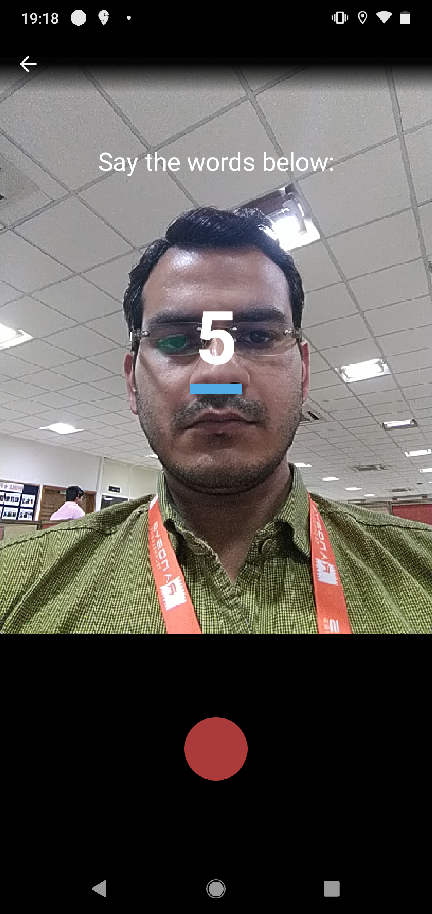

## DF-Liveliness Auth SDK


This SDK is created to capture a short video of user so that it could be sent to Datafornix server to check if the face in the video matches with the user's selfie or photo extracted from identity document.

An OTP of numbers will appear on screen while recording video and user have to speak those words, after recording spoken numbers will be matched via Speech-to-Text processing.

#### You can achieve the functionality with easy integration of following steps:
- In your project level `build.gradle` add this dependency:
```sh 
allprojects {
   repositories {
      jcenter()
       maven { url "https://dl.bintray.com/datafornix/dfvideoliveliness" }
    }
 } 
```
- In your app level `build.gradle` add this dependency:
```sh
implementation 'dfvideoliveliness:dfvideoliveliness:1.0.0'
```
- Now in your project's activity create `VideoLivelinessVerifier` object: 
```sh
private lateinit var videoLivelinessInstance: VideoLivelinessVerifier
```
- Initialise this object with your `sdkToken`
```sh
videoLivelinessInstance = VideoLivelinessVerifier(this, YOUR_SDK_TOKEN)
```

#### You can customise the colour and theme of the SDK's view according to your project's user-experience.
#### Just access the properties mentioned in the SDK. Have a look at the sample below:

```sh
val livelinessConfig = LivelinessConfig()
livelinessConfig.cameraScreenHintText = "Your hint text..."
livelinessConfig.cameraScreenHintTextColor = ContextCompat.getColor(this, R.color.black)
livelinessConfig.tutorialScreenBackgroundColor = ContextCompat.getColor(this, R.color.white)
```

- Call `checkVideoLiveliness()` function from `videoLivelinessInstance`
```sh
videoLivelinessInstance.checkVideoLiveliness(  
    livelinessConfig,  
    object : VideoLivelinessVerifier.LivelinessListener {  
        override fun onVideoVerifiedFailure(error: VideoLivelinessVerifier.VideoVerifyError) {  
		   // video authentication failed, show error message
            showMessage(error.message)  
        }  
  
        override fun onVideoVerifiedSuccess(uri: Uri, spokenNumber: String) {  
	        // video verification is successfull, get video saved path here
            callVideoUploadApi(uri)  
        }  
  
    })
```

- Override `onActivityResult`:
```sh
override fun onActivityResult(requestCode: Int, resultCode: Int, data: Intent?) {
   super.onActivityResult(requestCode, resultCode, data)
	 if (resultCode == Activity.RESULT_OK) {
	       videoLivelinessInstance.onVideoLivelinessResult(requestCode, resultCode, data)
          }
      }
}
```


#### By calling `checkVideoLiveliness()` method you will be redirected to the selfie authentication flow which is shown in below sequence of images:
<br>
<p align="left">


